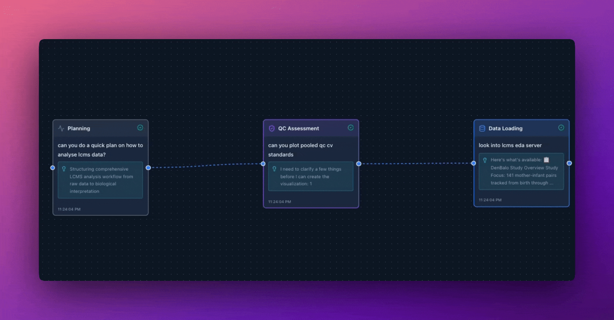
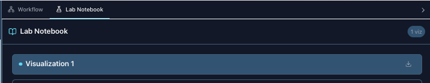
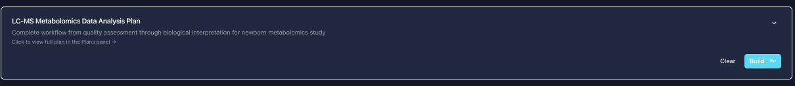

<div align="center">
  

  <h1>Nula Labs</h1>

  <p align="center">
    <strong>Zero-Shot Bioanalysis Agents</strong><br/>
    Empowering generalist AI models to perform specialist bioanalysis through curated MCP tools
  </p>

  <p align="center">
    <a href="https://github.com/kamilseghrouchni/nula-client/actions/workflows/ci.yml">
      
    </a>
    <a href="https://github.com/kamilseghrouchni/nula-client/stargazers">
      
    </a>
    <a href="https://github.com/kamilseghrouchni/nula-client/network/members">
      
    </a>
    <a href="https://github.com/kamilseghrouchni/nula-client/blob/main/LICENSE">
      
    </a>
  </p>

  <p align="center">
    <a href="https://nextjs.org">
      
    </a>
    <a href="https://react.dev">
      
    </a>
    <a href="https://www.typescriptlang.org/">
      
    </a>
    <a href="https://modelcontextprotocol.io">
      
    </a>
  </p>

  <p align="center">
    <a href="#-quick-start">Quick Start</a> •
    <a href="#-demos">Demos</a> •
    <a href="#-features">Features</a> •
    <a href="#-documentation">Documentation</a>
  </p>

</div>

---

## What is Nula Labs?

Nula Labs builds zero-shot bioanalysis agents that turn generalist AI models into domain specialists through curated MCP tools.

### The Thesis

**Generalist AI + Specialized Tools = Expert-Level Performance**

With the right tools bundled in MCP servers, any off-the-shelf generalist model (Claude, GPT-4, Gemini) can achieve comparable performance to specialized bioinformatics models for routine analysis tasks. This democratizes access to expert-level bioanalysis without requiring:

- Fine-tuning on proprietary datasets
- Domain-specific model training
- Expensive computational infrastructure
- Deep bioinformatics expertise

Instead, Nula Labs provides:

- **Curated MCP tool servers** - Pre-built, validated analysis capabilities
- **Intelligent orchestration** - AI agents that know when and how to use tools
- **Universal accessibility** - Any researcher can perform expert-level analysis through natural language
- **Reproducible workflows** - Automatic tracking and documentation of every analysis step

The result: streamlined bioinformatics analysis accessible to everyone, from wet-lab scientists to computational biologists.

### Who is it for?

**Scientists & Researchers**
- Ask questions about your data in natural language
- No programming required
- Get instant visualizations and statistical analysis
- Reproducible workflows automatically documented

**Bioinformaticians & CROs**
- Expose your analysis functions as MCP servers
- Scale your expertise to multiple scientists simultaneously
- No need to build custom UIs for each tool
- Scientists can query data independently

**Contract Research Organizations**
- Provide clients with self-service data analysis
- Maintain control over analysis logic (server-side)
- Track all analysis workflows for compliance
- Professional visualizations for client reports

---

## Powered by mcp-use

NulaLabs is built on [mcp-use](https://github.com/mcp-use/mcp-use), the TypeScript framework that makes MCP integration seamless.

### Why mcp-use?

**Multi-Server Management Made Simple:**
```typescript
// Connect to unlimited servers with one line
const client = MCPClient.fromDict(config);
await client.createAllSessions();
```

**Key Benefits:**

**Simultaneous Multi-Server Connections**
- Connect to all your analysis servers at once
- No manual client instantiation per server
- Automatic tool discovery and namespacing

**Graceful Degradation**
- System continues if one server fails
- Perfect for production environments
- Built-in error handling

**Simplified Authentication**
- Automatic `Bearer` token injection from `authToken` field
- Custom HTTP headers support
- Runtime environment variable resolution

**Transport Flexibility**
- HTTP and STDIO transports in single config
- Switch between local and remote servers seamlessly
- No code changes needed

**Developer Experience**
- TypeScript-first with full type safety
- Simple JSON configuration
- Comprehensive documentation

### Real-World Impact

Before mcp-use, managing multiple MCP servers required:
- Separate client instances per server
- Manual tool merging logic
- Complex error handling
- Custom authentication wrappers

**With mcp-use:**
```json
{
  "mcpServers": {
    "server1": { "url": "https://api1.com/mcp" },
    "server2": { "url": "https://api2.com/mcp" }
  }
}
```
Done. All servers connected, tools merged, ready to use.

[Learn more about mcp-use →](https://github.com/mcp-use/mcp-use)

---

## Demos

See Nula Labs in action with real research platforms and biological data:

<details open>
<summary><b>SleepyRat Integration - Sleep Stage Scoring (EPFL Research)</b></summary>

> "Analyze my eeg sleep data and visualize result"

<div align="center">
  
</div>

**What happens:**
1. AI connects to SleepyRat MCP server (ETHZ sleep research platform)
2. Lists available projects and recordings
3. Retrieves sleep stage scoring results (Wake, NREM, REM)
4. Performs statistical analysis on sleep patterns
5. Generates publication-ready visualizations
6. Creates comprehensive workflow: "Data Access → Analysis → Visualization"

**Real-world impact:**
- **Platform:** [SleepyRat](https://sleepyrat.ai) - Web platform for automated animal sleep scoring (ETHZ) - Thanks to @[AmiBeuret](https://amibeuret.com/) 
- **Research use:** 50+ publications cite this platform for sleep research
- **Analysis:** EEG/EMG signal processing, vigilance state classification, sleep dynamics
- **Integration:** Natural language queries to research-grade sleep analysis tools
- **Benefit:** Researchers interact with complex sleep data through conversation instead of manual data wrangling

**Server Type:** HTTP MCP server (sleepyrat.ai) with authentication

</details>

---

## Quick Start

Get started in under 2 minutes:

### For AI Agents

Direct your favorite coding agent to the Quick Start Guide below. Our system prompt is designed to work seamlessly with:
- Cursor
- Windsurf
- Aider
- Cline

### For Humans

1. **Install dependencies**
   ```bash
   git clone https://github.com/kamilseghrouchni/nula-client.git
   cd nula-client
   npm install
   ```

2. **Configure environment**
   ```bash
   cp .env.example .env
   # Add your ANTHROPIC_API_KEY
   ```

3. **Set up MCP servers**
   ```bash
   # Edit mcp-config.json with your server configurations
   ```

4. **Start the app**
   ```bash
   npm run dev
   # Open http://localhost:3000
   ```

5. **Start analyzing!**
   ```
   "Analyze the quality of my data"
   "Show me the distribution across samples"
   "Create an analysis plan for this dataset"
   ```

---

## Key Features

### Multi-MCP Server Integration

Connect to unlimited MCP servers simultaneously - access all your tools in one place without switching between applications.

- Automatic tool discovery and namespacing
- Graceful degradation if servers are unavailable
- Support for both local (STDIO) and remote (HTTP) servers
- Pre-configured integrations for popular data platforms

### Visual Workflow Tracking

Automatically maps your analysis journey into a visual workflow diagram. Never lose track of your analysis steps - perfect for reproducibility and documentation.

<div align="center">
  
</div>

**Features:**
- Real-time graph generation - workflow updates as you analyze
- Phase detection - automatic categorization (Data Loading → QC → Analysis → Visualization)
- Insight extraction - AI-generated summaries for each analysis step
- Interactive nodes - click to view details, artifacts, and reasoning
- Artifact preview - see visualizations directly in the workflow panel
- Export capabilities - download workflows for presentations and publications

The workflow graph is built in real-time from your conversation history. Each tool call becomes a node, and the AI's reasoning determines connections and phases. This creates a complete audit trail of your analysis from start to finish.

### Lab Notebook

Organizes all visualizations and artifacts in one searchable interface. Keep your analysis organized and accessible.

<div align="center">
  
</div>

**Gallery features:**
- Unified view - all visualizations in one scrollable gallery
- Artifact enumeration - track every chart and plot generated
- One-click downloads - export as PNG, SVG, or standalone HTML
- Quick navigation - scroll through your complete analysis history
- Organized by creation - chronological order maintains analysis flow
- High-quality exports - publication-ready visualizations

Perfect for reviewing your analysis, creating presentations, or archiving results. The lab notebook ensures no visualization is ever lost and makes it easy to revisit previous analyses.

### Strategic Planning

AI generates structured analysis plans with actionable steps. Get expert guidance on complex analyses.

<div align="center">
  
</div>

**Planning capabilities:**
- Structured plans - multi-phase analysis workflows with clear steps
- Actionable guidance - each step includes specific tools and parameters
- One-click execution - "Build" button or Cmd+Enter to start execution
- Plan persistence - automatic caching to filesystem for later reference
- Iterative refinement - ask for plan modifications before execution
- Progress tracking - visual indicators as each step completes

**Example plan structure:**
```markdown
<plan title="Metabolomics Data Analysis">
## Phase 1: Data Quality Assessment
- Calculate CV in PooledQC samples
- Assess reproducibility across batches

## Phase 2: Statistical Analysis
- Differential abundance testing
- Pathway enrichment analysis
</plan>
```

Perfect for complex multi-step analyses. The AI breaks down your research question into a clear roadmap, ensuring nothing is missed and all steps are executed in the right order.

### Smart Follow-up Suggestions

Context-aware next-step suggestions after each AI response. Streamlined workflow - one click to continue your analysis.

<div align="center">
  
</div>

**Features:**
- AI-generated - contextually relevant next questions based on results
- Analysis-aware - suggestions adapt to your current workflow phase
- One-click execution - click chip or press Enter to send
- Dynamic updates - new suggestions after each response
- Exploration guidance - discover insights you might have missed
- Auto-clear - suggestions vanish when you start typing your own question

After the AI responds, you'll see 2-3 suggested follow-up questions displayed as interactive chips below the input. These guide you through logical next steps in your analysis.

### Real-Time Tool Call Streaming

Watch MCP tool calls execute in real-time as the AI thinks and analyzes. Full transparency into the analysis process - see exactly which tools are being called, when, and with what parameters.

<div align="center">
  
</div>

**Live streaming features:**
- Real-time execution tracking - see tool calls appear as they happen
- Argument inspection - view the exact parameters passed to each tool
- Status indicators - know when tools are running, completed, or failed
- Result previews - instant feedback on tool execution outcomes
- Session continuity - all tool results stay in context for the entire conversation

**Technical implementation:**
- Powered by Vercel AI SDK's `streamText` with message part streaming
- Tool invocations streamed as `tool-call` message parts
- Results streamed back as `tool-result` message parts
- Zero latency between tool execution and UI updates
- Enables transparent, reproducible analysis workflows

### Privacy & Security

Enterprise-grade security for your sensitive data. Protect patient data, proprietary research, and confidential information.

- No hardcoded credentials in codebase
- Dynamic token injection from environment variables
- User data never exposed in responses
- Secure authentication handling

### Publication-Ready Visualizations

Professional interactive charts built with Recharts. Generate figures ready for papers and presentations.

- PCA plots, bar charts, line plots, scatter plots
- Statistical distribution visualizations
- Professional color palettes
- Responsive and interactive

---

## The Zero-Shot Bioanalysis Approach

### How It Works

**Traditional Approach:**
```
Fine-tuned Model → Specialized for One Task → Limited Flexibility
```

**Nula Labs Zero-Shot Approach:**
```
Generalist AI Model + Curated MCP Tools → Expert-Level Performance Across All Tasks
```

### Key Insights

**1. Tools > Training**
- **Old paradigm**: Train domain-specific models on massive datasets
- **New paradigm**: Equip generalist models with the right tools
- **Advantage**: Any off-the-shelf LLM (Claude, GPT-4, Gemini) becomes a bioanalysis expert

**2. MCP as the Enabler**
- **MCP servers bundle domain expertise** into reusable, composable tools
- Tools encode best practices, statistical methods, and domain knowledge
- AI agents orchestrate tools intelligently without domain-specific training

**3. Streamlining Routine Analysis**
- 80% of bioinformatics work is routine: QC, normalization, differential expression, pathway analysis
- These tasks don't need custom models - they need **reliable tool execution**
- Zero-shot agents handle routine work → Bioinformaticians focus on novel research

### Performance Claims

With curated MCP servers, generalist models achieve:

- Comparable accuracy to specialized tools for routine tasks
- Faster iteration - no retraining needed for new analysis types
- Better generalization - handles edge cases through reasoning
- Lower barrier to entry - accessible through natural language

### Infrastructure Vision

**Today**: Client application (this repository)
**Tomorrow**: Full MCP server ecosystem

Nula Labs is building the infrastructure to make zero-shot bioanalysis easily accessible:

1. Curated MCP tool servers - validated, production-ready analysis capabilities
2. Optimized orchestration - token-efficient, atomic tool architectures
3. Reproducible workflows - automatic tracking and documentation
4. Universal access - any researcher, any model, expert-level analysis

---

## What's Next for Nula Labs

### 1. Multi-Model Provider Support
- **UI Provider Switcher**: Add interface for selecting different AI providers (Claude, GPT-4, Gemini, etc.)
- **Provider-Agnostic Architecture**: Support any model with tool-use capabilities
- **Seamless Switching**: Change providers without reconfiguring MCP servers
- **Current Status**: Claude Sonnet 4.5 (best tool-use performance)

### 2. MCP Cookiecutter Template
- **Production-Ready Template**: Publish cookiecutter for rapid MCP server creation
- **Best Practices**: Security, error handling, documentation, testing patterns
- **Quick Start**: Researchers expose their analysis functions in minutes, not days
- **Examples Included**: Reference implementations for common analysis tasks

### 3. Domain-Specific MCP Server Library
Rolling out curated MCP servers for different research fields:
- **Proteomics**: Protein identification, quantification, PTM analysis
- **Genomics**: Variant calling, gene expression, pathway analysis
- **Clinical Data**: EHR analysis, cohort studies, survival analysis
- **Imaging**: Medical image processing, quantification, segmentation
- **Chemistry**: Molecular dynamics, docking, QSAR modeling

**Goal**: Build an ecosystem where researchers can plug in specialized tools and immediately gain AI-powered analysis capabilities.

---

## Why Nula Labs?

<table>
<tr>
<td width="50%" valign="top">

### Traditional Workflow
1. Open multiple analysis tools
2. Copy-paste data between applications
3. Write custom scripts for each analysis
4. Manually track analysis steps
5. Recreate visualizations for publication
6. Document workflow in separate file

**Time:** 2-3 hours per analysis

</td>
<td width="50%" valign="top">

### With Nula Labs (Zero-Shot)
1. Ask a question in natural language
2. AI selects and executes the right tools
3. Analysis runs across multiple MCP servers
4. Workflow tracked visually in real-time
5. Publication-ready charts generated
6. Complete documentation auto-created

**Time:** 5-10 minutes per analysis

</td>
</tr>
</table>

### Comparison

| Feature | Traditional Tools | Specialized Models | Nula Labs (Zero-Shot) |
|---------|------------------|-------------------|----------------------|
| **Setup Time** | Hours | Weeks (training) | Minutes |
| **Domain Expertise Required** | High | Very High | None (natural language) |
| **Flexibility** | Low | Very Low | High (any task) |
| **Reproducibility** | Manual | Limited | Automatic |
| **Multi-Server Access** | Manual switching | Single model | One interface |
| **Model Updates** | N/A | Retrain required | Automatic (latest LLMs) |
| **Learning Curve** | Steep | Very Steep | Minimal |
| **Cost** | Low | Very High | Low |

---

## Quick Start

### Prerequisites

- Node.js 20+ ([Download](https://nodejs.org))
- npm or yarn
- Anthropic API key ([Get one](https://console.anthropic.com))

### Installation

```bash
# Clone the repository
git clone https://github.com/kamilseghrouchni/nula-client.git
cd nula-client

# Install dependencies
npm install

# Set up environment variables
cp .env.example .env
```

### Configure Environment

Create a `.env` file in the project root:

```bash
# Required: Anthropic API Key (Claude Sonnet 4.5)
ANTHROPIC_API_KEY=sk-ant-your_api_key_here

# Optional: MCP Server Authentication (if your servers require auth)
# MY_SERVER_TOKEN=your_token_here
# ANOTHER_SERVER_TOKEN=another_token
```

**Note:** The `.env` file is gitignored and never committed to version control.

### Configure MCP Servers

Create `mcp-config.json` at the project root (copy from `mcp-config.example.json`):

**HTTP Server Example:**
```json
{
  "mcpServers": {
    "my-analysis-server": {
      "url": "https://your-server-url.com/mcp",
      "transport": "http",
      "headers": {
        "Authorization": "Bearer YOUR_TOKEN_HERE"
      }
    }
  }
}
```

**Local STDIO Server Examples:**

*JavaScript/TypeScript Server (via npx):*
```json
{
  "mcpServers": {
    "my-local-server": {
      "command": "npx",
      "args": ["-y", "@your-org/mcp-server", "/path/to/data"],
      "transport": "stdio",
      "env": {
        "CUSTOM_ENV_VAR": "value"
      }
    }
  }
}
```

*Python Server (via uv):*
```json
{
  "mcpServers": {
    "my-python-server": {
      "command": "uv",
      "args": ["run", "/absolute/path/to/server.py"],
      "transport": "stdio",
      "env": {
        "PYTHONPATH": "/path/to/your/modules"
      }
    }
  }
}
```

*Python Server (via python directly):*
```json
{
  "mcpServers": {
    "stats-server": {
      "command": "python",
      "args": ["-m", "my_analysis_server"],
      "transport": "stdio"
    }
  }
}
```

**Important:** Always use **absolute paths** for local servers to avoid path resolution issues.

**Multiple Servers Example:**
```json
{
  "mcpServers": {
    "eda-server": {
      "url": "https://eda.example.com/mcp",
      "transport": "http"
    },
    "stats-server": {
      "command": "python",
      "args": ["-m", "stats_mcp_server"],
      "transport": "stdio"
    }
  }
}
```

**Note:** `mcp-config.json` is gitignored and never committed to version control.

### Run the Application

```bash
# Start development server
npm run dev

# Open http://localhost:3000 in your browser
```

**That's it!** Start chatting with your AI assistant and analyze your data.

---

## Requirements & Compatibility

### AI Model Support
- **Primary:** Anthropic Claude Sonnet 4.5 (recommended)
- **API:** Anthropic API via `@ai-sdk/anthropic`
- **Why Anthropic?** Best-in-class reasoning, tool use, and scientific analysis capabilities

### MCP Compatibility
- **MCP Version:** 2024-11-05 specification
- **Framework:** mcp-use v1.2.2+
- **Transports:** HTTP and STDIO
- **Server Types:** Any MCP-compliant server

### Supported MCP Server Types
NulaLabs works with ANY MCP server that provides:
- ✅ Data loading/querying tools
- ✅ Statistical analysis functions
- ✅ Data transformation capabilities
- ✅ File system access (optional)

**Examples of compatible servers:**
- Biological data analysis servers (metabolomics, proteomics, genomics)
- Statistical analysis servers (R, Python-based)
- Database query servers (SQL, NoSQL)
- File system servers (for data access)
- Custom domain-specific servers built by your team

### Environment Requirements
- Node.js 20+
- npm or yarn
- Anthropic API key (get from [console.anthropic.com](https://console.anthropic.com))

---

## Usage Guide

### Basic Workflow

1. **Start a conversation** - Ask a question about your data
2. **AI initializes** - Automatically connects to MCP servers and loads tools
3. **Get insights** - Receive analysis, visualizations, and recommendations
4. **Track progress** - View workflow diagram in real-time
5. **Export results** - Download visualizations and workflow diagrams

### Example Conversations

**Quality Control Analysis:**
```
You: "Analyze the quality of my data"
AI: [Initializes session, connects to servers, loads data]
    "I've calculated quality metrics. Average CV is 12%..."
    [Workflow node created: "QC Assessment"]
    [Generates QC metrics visualization]
Follow-up: "Would you like to see outlier detection results?"
```

**Exploratory Data Analysis:**
```
You: "Show me the distribution across sample groups"
AI: [Lists available datasets, loads selected data]
    "Found 145 samples across 4 groups. Here's the distribution..."
    [Workflow node created: "Data Loading"]
    [Generates distribution visualization]
Follow-up: "Shall I perform statistical comparison between groups?"
```

### Workflow Visualization

The workflow panel automatically tracks your analysis:

```
Session Init → Data Loading → QC Assessment → Statistical Analysis → Visualization
     ↓              ↓               ↓                   ↓                  ↓
  Projects      Loaded 245       CV: 12%         p<0.05 (23)        Bar Chart
  Available     metabolites      No outliers      metabolites        Generated
```

### Using the Lab Notebook

1. Click "Notebook" in the top-right panel
2. Browse all generated visualizations
3. Click the download icon to export as HTML
4. Share standalone files with collaborators

### Strategic Plans

Ask for analysis guidance:

```
You: "Create a plan for analyzing this metabolomics dataset"
AI: [Generates structured plan]
    Phase 1: QC Assessment
    Phase 2: Statistical Testing
    Phase 3: Pathway Analysis
```

Click on a plan to execute it step-by-step.

---

## For CROs & Bioinformaticians

### Building MCP Servers for Your Team

NulaLabs is designed to work with YOUR analysis functions. By exposing your tools as MCP servers, you can:

**Scale Your Expertise:**
- Write analysis code once
- Make it accessible to all scientists via natural language
- No need to build custom UIs for each tool
- Scientists work independently without bottlenecking your team

**Maintain Control:**
- Analysis logic stays server-side (your control)
- Scientists can't accidentally modify algorithms
- Easy to update tools without client changes
- Version control and reproducibility built-in

**Perfect for CROs:**
- Provide clients with self-service analysis
- Track all analysis workflows for compliance
- Professional visualizations for reports
- Maintain IP protection (server-side code)

### How to Create an MCP Server

**Option 1: Python (Recommended for Data Scientists)**
```python
from mcp import Server
import pandas as pd

server = Server("my-analysis-server")

@server.tool()
def calculate_stats(dataset_id: str) -> dict:
    """Calculate descriptive statistics for a dataset."""
    df = load_dataset(dataset_id)
    return {
        "mean": df.mean().to_dict(),
        "std": df.std().to_dict(),
        "n_samples": len(df)
    }

if __name__ == "__main__":
    server.run()
```

**Option 2: TypeScript/JavaScript**
```typescript
import { Server } from "@modelcontextprotocol/sdk/server/index.js";

const server = new Server({
  name: "my-analysis-server",
  version: "1.0.0"
});

server.setRequestHandler(ListToolsRequestSchema, async () => ({
  tools: [{
    name: "calculate_stats",
    description: "Calculate descriptive statistics",
    inputSchema: { /* ... */ }
  }]
}));
```

**Deploy Your Server:**
- **Local:** Run via STDIO (perfect for desktop deployment)
- **Remote:** Deploy to Railway, Heroku, AWS Lambda
- **Containerized:** Docker for reproducible environments

### Integration Architecture

```
Scientists (Nula Labs Client)
         ↓
    Natural Language Query
         ↓
   Claude Sonnet 4.5
         ↓
    Your MCP Servers (HTTP/STDIO)
         ↓
    Your Analysis Functions
         ↓
    Your Data Sources
```

**Benefits:**
- Scientists ask questions in English
- AI translates to tool calls
- Your code executes server-side
- Results returned as JSON
- Visualizations generated automatically

### Example Use Cases

**Metabolomics Lab:**
```
Server Tools: load_data, calculate_cv, detect_outliers, pathway_analysis
Scientists ask: "What's the quality of batch 5?"
→ AI calls: calculate_cv(batch=5) → Returns: CV metrics
→ Generates: Interactive bar chart
```

**CRO Serving Pharma Clients:**
```
Server Tools: query_samples, run_stats, generate_report
Client asks: "Compare treatment vs control"
→ AI calls: query_samples(groups=["treatment","control"])
→ AI calls: run_stats(test="ttest")
→ Generates: Statistical comparison with p-values
```

**Genomics Pipeline:**
```
Server Tools: align_reads, call_variants, annotate
Researcher asks: "Run variant calling on sample X"
→ AI calls: align_reads(sample="X")
→ AI calls: call_variants(aligned_bam="X.bam")
→ Tracks: Complete workflow with each step
```

### Resources for Building Servers

- **MCP Documentation:** [modelcontextprotocol.io](https://modelcontextprotocol.io)
- **Example Servers:** [github.com/modelcontextprotocol](https://github.com/modelcontextprotocol)
- **mcp-use Framework:** [github.com/mcp-use/mcp-use](https://github.com/mcp-use/mcp-use)

---

## Configuration

### MCP Server Setup

Configuration examples are provided in the [Configure MCP Servers](#configure-mcp-servers) section above. Both HTTP and STDIO transports are supported.

### Environment Variables

```bash
# Required: Anthropic API for Claude Sonnet 4.5
ANTHROPIC_API_KEY=sk-ant-...

# Optional: MCP Server Tokens (if your servers require authentication)
# Use ${VARIABLE_NAME} syntax in mcp-config.json to reference these
MY_SERVER_TOKEN=your_token_here
ANOTHER_SERVER_TOKEN=another_token_here
```

**Security Note:** All environment variables are gitignored and never committed to version control.

---

## Architecture

### Tech Stack

| Component | Technology |
|-----------|-----------|
| **Framework** | Next.js 16 (App Router) |
| **UI** | React 19, Tailwind CSS 4 |
| **AI** | Anthropic Claude Sonnet 4.5 via `@ai-sdk/anthropic` |
| **MCP** | mcp-use v1.2.2 (built on @modelcontextprotocol/sdk) |
| **Visualization** | Recharts, ReactFlow |
| **State** | React hooks, client-side caching |

### Project Structure

```
nula-client/
├── src/
│   ├── app/
│   │   ├── api/
│   │   │   └── chat/              # Main chat API route
│   │   └── chat/                  # Chat page UI
│   ├── components/
│   │   ├── chat/                  # Message components
│   │   ├── workflow/              # Workflow visualization
│   │   ├── notebook/              # Lab notebook
│   │   ├── artifact/              # Artifact rendering
│   │   ├── plans/                 # Strategic plans
│   │   └── ui/                    # UI primitives
│   └── lib/
│       ├── mcp/                   # MCP client management
│       │   ├── multiClient.ts     # Multi-server manager
│       │   ├── config.ts          # Configuration loader
│       │   └── tokenFetcher.ts    # Secure token handling
│       ├── workflow/              # Workflow building
│       │   ├── workflowBuilder.ts # Graph construction
│       │   ├── phaseDetector.ts   # Phase detection
│       │   └── metadataExtractor.ts # Insight extraction
│       ├── prompts/               # System prompts
│       └── utils/                 # Utilities
├── mcp-config.json                # MCP server configuration
├── .env                           # Environment variables (create from .env.example)
└── .env.example                   # Example environment file
```

### Data Flow

```
User Input → Next.js API Route → MCP Client Manager → Multiple MCP Servers
                                        ↓
                                  Tool Discovery
                                        ↓
                               Claude Sonnet 4.5 ← System Prompts
                                        ↓
                                  Streaming Response
                                        ↓
                            Workflow Builder + Insight Extractor
                                        ↓
                              UI (Chat + Workflow + Notebook)
```

---

## Development

### Development Commands

```bash
# Start development server (with hot reload)
npm run dev

# Build for production
npm run build

# Start production server
npm start

# Run linter
npm run lint
```

### Adding a New MCP Server

1. **Add configuration to `mcp-config.json`**

```json
{
  "mcpServers": {
    "my-server": {
      "command": "npx",
      "args": ["-y", "@my-org/mcp-server"]
    }
  }
}
```

2. **Add environment variables to `.env` (if needed)**

```bash
MY_SERVER_TOKEN=your_token
```

3. **Restart the development server**

```bash
npm run dev
```

4. **Verify connection**

Check the console for: `[MCP] ✓ Connected to my-server`

### Customizing AI Behavior

Edit `src/lib/prompts/system.ts`:

```typescript
export function buildSystemPrompt(): string {
  return `You are a data analysis assistant...

  // Add your custom instructions here
  `;
}
```

### Creating Custom Visualizations

All visualizations must use Recharts:

```jsx
import { BarChart, Bar, XAxis, YAxis } from 'recharts';

export default function CustomViz() {
  const data = [/* your data */];

  return (
    <BarChart data={data}>
      <XAxis dataKey="name" />
      <YAxis />
      <Bar dataKey="value" fill="#3b82f6" />
    </BarChart>
  );
}
```

---

## Visualization Guidelines

### Allowed Libraries
- ✅ **recharts** - All components (Bar, Line, Scatter, Pie, Area, etc.)
- ✅ **react hooks** - useState, useEffect, useMemo, etc.
- ❌ **plotly, d3, matplotlib** - Not allowed (sandboxing restrictions)

### Professional Color Palette

```typescript
const colors = {
  primary: '#3b82f6',      // Blue - main data
  secondary: '#6366f1',    // Indigo - secondary data
  tertiary: '#8b5cf6',     // Purple - tertiary data
  success: '#10b981',      // Emerald - positive/success
  warning: '#f59e0b',      // Amber - warnings
  danger: '#ef4444',       // Red - errors/critical
  muted: '#9ca3af'         // Gray - text/grid
};
```

### Example: Professional Bar Chart

```jsx
import { BarChart, Bar, XAxis, YAxis, CartesianGrid, Tooltip, ResponsiveContainer } from 'recharts';

export default function MetaboliteDistribution() {
  const data = [
    { metabolite: 'Glucose', concentration: 5.2 },
    { metabolite: 'Lactate', concentration: 1.8 },
    { metabolite: 'Pyruvate', concentration: 0.15 }
  ];

  return (
    <div className="p-4">
      <h3 className="text-lg font-semibold mb-4">Metabolite Concentrations</h3>
      <ResponsiveContainer width="100%" height={400}>
        <BarChart data={data}>
          <CartesianGrid strokeDasharray="3 3" stroke="rgba(156, 163, 175, 0.2)" />
          <XAxis
            dataKey="metabolite"
            tick={{ fill: '#9ca3af', fontSize: 12 }}
          />
          <YAxis
            tick={{ fill: '#9ca3af', fontSize: 12 }}
            label={{ value: 'Concentration (mM)', angle: -90, position: 'insideLeft' }}
          />
          <Tooltip
            contentStyle={{
              backgroundColor: '#1f2937',
              border: '1px solid #374151',
              borderRadius: '8px'
            }}
          />
          <Bar dataKey="concentration" fill="#3b82f6" radius={[8, 8, 0, 0]} />
        </BarChart>
      </ResponsiveContainer>
    </div>
  );
}
```

---

## Contributing

We welcome contributions from the community! Whether you're fixing bugs, adding features, or improving documentation, your help is appreciated.

### Ways to Contribute

- 🐛 **Report bugs** - Found an issue? Let us know!
- ✨ **Request features** - Have an idea? We'd love to hear it!
- 📖 **Improve docs** - Help others get started
- 💻 **Submit PRs** - Code contributions welcome

### Development Workflow

1. **Fork the repository**

```bash
git clone https://github.com/kamilseghrouchni/nula-client.git
cd nula-client
```

2. **Create a feature branch**

```bash
git checkout -b feature/amazing-feature
```

3. **Make your changes**
   - Follow existing code style
   - Add TypeScript types
   - Test thoroughly

4. **Commit with descriptive messages**

```bash
git commit -m "feat: add support for custom MCP servers"
```

5. **Push and create PR**

```bash
git push origin feature/amazing-feature
```

### Code Guidelines

- ✅ Use TypeScript for all new code
- ✅ Follow existing component patterns
- ✅ Add comments for complex logic
- ✅ Keep functions focused and small
- ✅ Test with multiple MCP servers

---

## License

MIT © Nula Labs Contributors

See [LICENSE](LICENSE) for full details.

---

## Acknowledgments

Built with amazing open-source technologies:

- [Next.js](https://nextjs.org) - React framework
- [Anthropic Claude](https://anthropic.com) - AI language model
- [Model Context Protocol](https://modelcontextprotocol.io) - MCP specification
- [Radix UI](https://radix-ui.com) - UI components
- [Recharts](https://recharts.org) - Visualization library
- [Tailwind CSS](https://tailwindcss.com) - Styling
- [Vercel AI SDK](https://sdk.vercel.ai) - AI streaming

Special thanks to the open-source community!

---

## Resources

- **Documentation**
  - [Model Context Protocol Docs](https://modelcontextprotocol.io)
  - [Next.js Documentation](https://nextjs.org/docs)
  - [Anthropic API Docs](https://docs.anthropic.com)

- **Related Projects**
  - [mcp-use](https://github.com/mcp-use/mcp-use) - MCP client framework (powers Nula Labs)
  - [Model Context Protocol](https://modelcontextprotocol.io) - MCP specification

---

<div align="center">

**Built with ❤️ for the research community**

*Transform your data analysis workflow today with Nula Labs*

</div>
