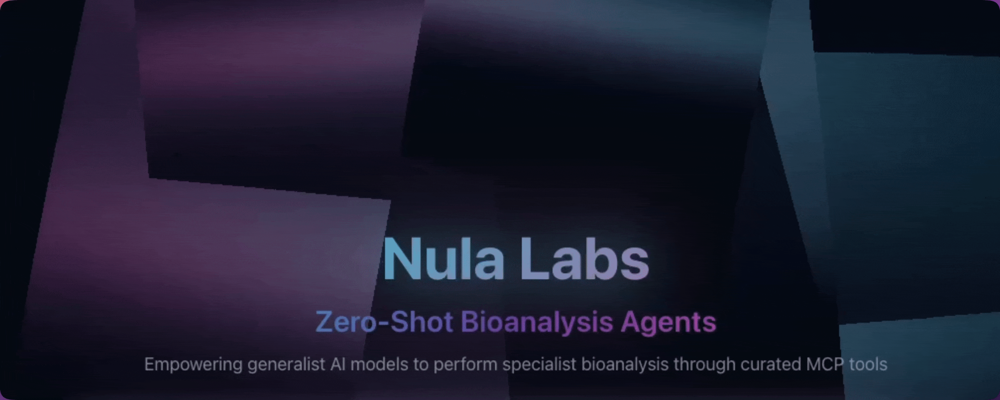
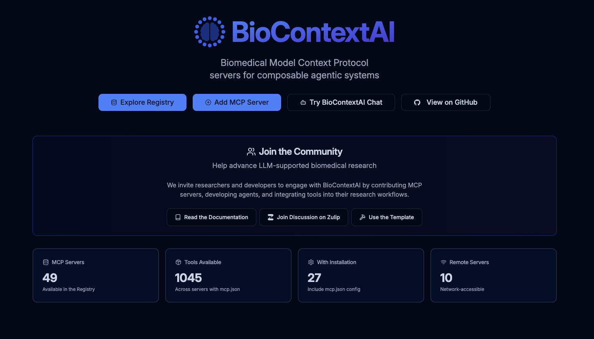
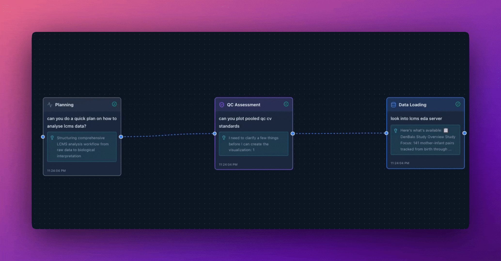
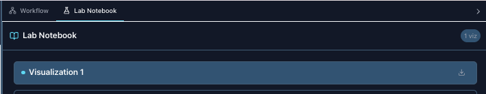
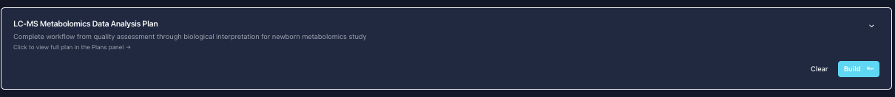

<div align="center">
  

  <p>
    
    <a href="https://github.com/kamilseghrouchni/nula-client/stargazers">
      
    </a>
    <a href="https://github.com/kamilseghrouchni/nula-client/blob/main/LICENSE">
      
    </a>
  </p>

  <p>
    <a href="https://nextjs.org">
      
    </a>
    <a href="https://react.dev">
      
    </a>
    <a href="https://www.typescriptlang.org/">
      
    </a>
    <a href="https://modelcontextprotocol.io">
      
    </a>
  </p>

</div>

---

## See It In Action

### Full Workflow Demo: Longevity Pathway Analysis

<div align="center">
  
</div>

**Query:** "What are the top 5 hottest druggable pathways for longevity?"

**What NulaLabs does**:
1. Queries OpenGenes database → longevity genes and lifespan experiments
2. Queries SynergyAge database → genetic synergy and aging research
3. Searches PubMed → recent articles on longevity pathways
4. Searches clinical trials → aging-related mechanisms
5. Generates visual report → ranked by lifespan extension potential

**Tools used**: OpenGenes, SynergyAge, PubMed, ClinicalTrials.gov
**Result**: Publication-ready analysis saved to lab notebook

### Access to 27+ MCP Servers from BioContextAI Registry

<div align="center">
  
</div>

**NulaLabs automatically connects to all 27 installable servers:**
- 1045+ tools across genomics, proteomics, clinical trials, pharmacology
- Auto-updates from biocontext.ai registry
- One Docker command → full access

### More Research Examples

<details>
<summary><b>Sleep Analysis (SleepyRat)</b></summary>

<div align="center">
  
</div>

Query EEG data → Statistical analysis → Publication-ready charts

</details>

---

## Quick Start

**Get all 230+ tools running in 3 steps:**

### 1. Build and Run the MCP Hub
```bash
cd mcp-hub
docker build -t mcp-hub .
docker run -p 9000:9000 mcp-hub
```

### 2. Run NulaLabs
```bash
git clone https://github.com/kamilseghrouchni/nula-client.git
cd nula-client
npm install
echo "ANTHROPIC_API_KEY=your-key" > .env
npm run dev
```

### 3. Open and explore
```
http://localhost:3000
```

**Requirements**: Docker, Node.js 20+, [Anthropic API key](https://console.anthropic.com)

---

## What is NulaLabs?

An AI-powered lab notebook built on top of the amazing [BioContextAI Registry](https://biocontext.ai/registry).

**Core Features**:
- 📊 **Interactive visualizations** - Generate and save publication-ready charts
- 🔬 **Workflow tracking** - Auto-generated audit trail of your analysis
- 📚 **Gallery view** - All results organized and downloadable
- 🤖 **AI-guided analysis** - Strategic plans for complex multi-step workflows

**Built on excellence**: Leverages 230+ tools from the BioContextAI ecosystem, combining them with local control and lab notebook features.

**Powered by**: [BioContextAI Registry](https://biocontext.ai/registry) • Claude Sonnet 4.5 • [mcp-use](https://github.com/mcp-use/mcp-use) • Runs locally

---

## Building on Top of Great Work

NulaLabs builds on the excellent foundation provided by [BioContextAI](https://biocontext.ai) and the broader MCP ecosystem.

### BioContextAI: The Foundation

**[BioContextAI](https://biocontext.ai)** created an incredible registry of 27+ biotech MCP servers with 1045+ tools. Their work makes biotech research accessible through AI. We're grateful for their pioneering efforts in bringing MCP to biomedical research.

<div align="center">
  
</div>

### What NulaLabs Adds

While **BioContext Chat** provides instant access (no setup required), NulaLabs extends this foundation with:

**Lab Notebook Features:**
- 📊 Interactive workflow visualization with auto-generated audit trails
- 📚 Artifact gallery - save and download all visualizations
- 🧠 Strategic planning system with step-by-step execution
- 📈 Publication-ready charts with consistent styling

**Local Control:**
- 🔑 Your own Claude API key (no rate limits)
- 💾 Local data storage and processing
- ⚙️ Full access to all 27 registry servers simultaneously
- 🐳 Docker-based deployment for reproducibility

**Perfect for:**
- Researchers who need local data control
- Teams building reproducible analysis pipelines
- Labs requiring comprehensive audit trails
- Anyone wanting the full power of the registry locally

| Feature | BioContext Chat | NulaLabs |
|---|---|---|
| **Setup** | None (instant) | One Docker command |
| **Tools** | 8 tools (curated) | 230+ tools (full registry) |
| **Model** | Shared (rate-limited) | Your Claude API |
| **Interface** | Web chat | AI-powered lab notebook |
| **Best For** | Quick queries | Research workflows |

---

## Features

### 🧬 230+ Biotech Tools, Auto-Connected
Single Docker container → all BioContext Registry servers
- PubMed, UniProt, STRING, Reactome, PDB, ClinicalTrials.gov, and more
- Auto-updates from biocontext.ai/mcp.json
- Smart routing with automatic tool-to-server mapping

### 📊 Lab Notebook Features

**Workflow tracking**

<div align="center">
  
</div>

- Auto-generated analysis audit trail
- Phase detection (Data Loading → QC → Analysis → Viz)
- Click nodes to see details, artifacts, reasoning

**Gallery view**

<div align="center">
  
</div>

- All visualizations in one scrollable gallery
- Download as PNG, SVG, or HTML
- Never lose a generated plot

**Strategic plans**

<div align="center">
  
</div>

- AI generates step-by-step analysis roadmaps
- One-click execution (Build button or Cmd+Enter)
- Plan caching for later reference

**Interactive visualizations**
- Recharts-based plots, no coding required
- Publication-ready with consistent color palette
- Hover tooltips, zoom, responsive sizing

### 💰 90% Cost Reduction
- Anthropic prompt caching: 5k → 500 tokens per follow-up
- Auto-summarization: 40k → 7k tokens when needed
- Session context: prevents redundant tool calls

### 🛠️ Code Execution Engine
- JavaScript VM with MCP tool access
- Tool discovery: `search_tools(query)`
- Multi-server orchestration in one script

### 🔌 Multi-Server Support & Code Execution

Built on [mcp-use](https://github.com/mcp-use/mcp-use) for seamless multi-server orchestration:

**JavaScript Execution Engine**
- Run custom scripts with MCP tool access
- `search_tools(query)` - discover tools across all servers
- Orchestrate multiple servers in a single script
- Full JavaScript VM with async/await support

**Multi-Server Management**
- Connect unlimited servers simultaneously
- Graceful degradation - system continues if one server fails
- HTTP + STDIO + SSE transports
- One config file → all servers connected

**vs Manual Configuration:**
```typescript
// Manual approach: configure each server separately
// mcp-use approach: one config, all servers auto-connected
{
  "mcpServers": {
    "server1": { "url": "https://api1.com" },
    "server2": { "url": "https://api2.com" }
  }
}
```
All tools merged, namespaced, ready to use.

---

## How It Works

```
You ask a question
       ↓
NulaLabs (Next.js lab notebook)
       ↓
Claude Sonnet 4.5
       ↓
MCP Hub (Docker) ← Auto-fetches 27+ servers from biocontext.ai
       ↓
230+ biotech tools
       ↓
Results saved to your lab notebook
```

No configuration. No manual server setup.

---

## MCP Hub Details

After running the MCP Hub, verify it's working:

```bash
# Check the SSE endpoint
curl http://localhost:9000/sse
# Should return: event: endpoint, data: /messages/?session_id=...
```

**How it works**:
1. Downloads https://biocontext.ai/mcp.json
2. Installs servers via `uv tool install` / `npm install -g`
3. Gateway exposes all tools on port 9000

**Architecture:**

```
┌──────────────────────────────────────────────────────────────┐
│                     Docker Container                          │
│                                                               │
│  ┌──────────────────────────────────────────────────────────┐│
│  │                   MCP Gateway (FastMCP)                  ││
│  │                                                          ││
│  │   • Aggregates tools from all servers                    ││
│  │   • Routes tool calls to correct backend                 ││
│  │   • Exposes unified SSE endpoint on port 9000            ││
│  └────────┬─────────┬─────────┬─────────┬──────────────────┘│
│           │         │         │         │                    │
│      ┌────▼───┐ ┌───▼───┐ ┌───▼───┐ ┌───▼───┐              │
│      │PubMed  │ │UniProt│ │STRING │ │ ...   │              │
│      │(uvx)   │ │(uvx)  │ │(remote)│ │(27+)  │              │
│      └────────┘ └───────┘ └───────┘ └───────┘              │
│                                                               │
└──────────────────────────────────────────────────────────────┘
```

**Environment variables**: See [mcp-hub/README.md](./mcp-hub/README.md) for details

---

## Documentation

**Project docs**:
- [MCP Hub Details](./mcp-hub/README.md) - Docker deployment, architecture
- [BioContext Integration](./docs/MCP_BIOCONTEXT_INTEGRATION.md) - Registry connection
- [Developer Guide](./CLAUDE.md) - Full project architecture

**External**:
- [BioContextAI Registry](https://biocontext.ai/registry) - Browse available servers
- [Model Context Protocol](https://modelcontextprotocol.io) - MCP specification
- [mcp-use Framework](https://github.com/mcp-use/mcp-use) - Multi-server orchestration

---

## Roadmap

### v1.x - Multi-Model Support
- **Provider Flexibility**
  - Add support for OpenAI, Google Gemini, and other providers
  - Currently Anthropic-only; expanding to model-agnostic architecture
  - UI provider switcher for easy model selection
  - Cost comparison across providers
- **Search Tool Enhancement**
  - Make search functionality model-agnostic
  - Support multiple AI providers in search interface

### v2.0 - Specialized Bio-Agents
- **BioMini**
  - Domain-specific AI agents for biotech tasks
  - Faster, cheaper specialized reasoning
  - Expert-level bioanalysis performance
- **UI Polish**
  - Consistent workflow visualization elements
  - Better step labeling and summarization
  - Improved artifact gallery UI
  - Enhanced mobile responsiveness

### v3.0 - Hosted Platform
- **Cloud Deployment**
  - Managed hosting option
  - Pre-configured MCP servers
  - No local setup required
- **Team Features**
  - Shared lab notebooks
  - Collaborative workflows
  - Access control and permissions
- **Advanced MCP Ecosystem**
  - Custom MCP server templates
  - Domain-specific server library
  - Cookiecutter templates for rapid development

[Track progress on GitHub Issues →](https://github.com/kamilseghrouchni/nula-client/issues)

---

## Contributing

Found a bug? Want a feature? [Open an issue](https://github.com/kamilseghrouchni/nula-client/issues) or submit a PR.

```bash
git clone https://github.com/kamilseghrouchni/nula-client.git
git checkout -b feature/my-feature
# make changes
git commit -m "feat: add new feature"
git push
```

**Guidelines**: TypeScript, follow existing patterns, test with multiple servers

---

## Acknowledgments

Built with [Next.js](https://nextjs.org), [Anthropic Claude](https://anthropic.com), [mcp-use](https://github.com/mcp-use/mcp-use), [BioContextAI](https://biocontext.ai), and other open-source tools.

**Citation**: BioContextAI was featured in [Nature Biotechnology](https://doi.org/10.1038/s41587-025-02900-9) as "a community hub for agentic biomedical systems."

---

<div align="center">

**Built for the research community**

</div>
